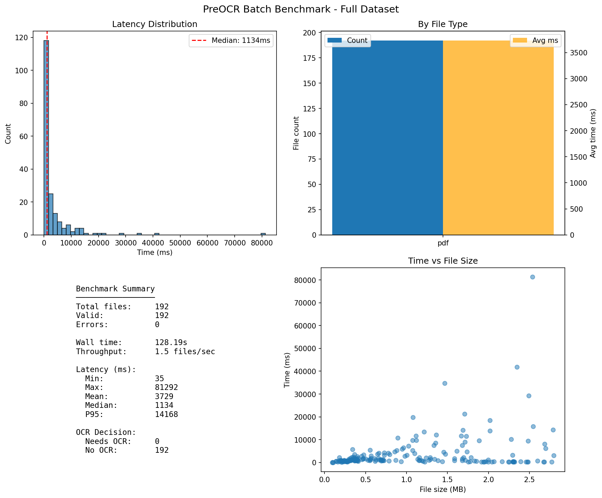

# PreOCR – Python OCR Detection Library | Skip OCR for Digital PDFs

<div align="center">

**Open-source Python library for OCR detection and document extraction. Detect if PDFs need OCR before expensive processing—save 50–70% on OCR costs.**

[](https://www.python.org/downloads/)
[](LICENSE)
[](https://badge.fury.io/py/preocr)
[](https://pepy.tech/project/preocr)
[](https://github.com/psf/black)

*2–10× faster than alternatives • 100% accuracy on benchmark • CPU-only, no GPU required*

**🌐 [preocr.io](https://preocr.io)** • [Installation](#-installation) • [Quick Start](#-quick-start) • [API Reference](#-api-reference) • [Examples](#-usage-examples) • [Performance](#-performance)

</div>

---

### ⚡ TL;DR

| Metric | Result |
|--------|--------|
| **Accuracy** | 100% (TP=1, FP=0, TN=9, FN=0) |
| **Latency** | ~2.7s mean, ~1.9s median (≤1MB PDFs) |
| **Office docs** | ~7ms |
| **Focus** | Zero false positives. Zero missed scans. |

---

## What is PreOCR? Python OCR Detection & Document Processing

**PreOCR** is an open-source **Python OCR detection library** that determines whether documents need OCR before you run expensive processing. It analyzes **PDFs**, **Office documents** (DOCX, PPTX, XLSX), **images**, and text files to detect if they're already machine-readable—helping you **skip OCR** for 50–70% of documents and cut costs.

Use PreOCR to filter documents before Tesseract, AWS Textract, Google Vision, Azure Document Intelligence, or MinerU. Works offline, CPU-only, with 100% accuracy on validation benchmarks.

**🌐 [preocr.io](https://preocr.io)**

### Key Benefits

- ⚡ **Fast**: CPU-only, typically < 1 second per file—no GPU needed
- 🎯 **Accurate**: 92–95% accuracy (100% on validation benchmark)
- 💰 **Cost-Effective**: Skip OCR for 50–70% of documents
- 📊 **Structured Extraction**: Tables, forms, images, semantic data—Pydantic models, JSON, or Markdown
- 🔒 **Type-Safe**: Full Pydantic models with IDE autocomplete
- 🚀 **Offline & Production-Ready**: No API keys; battle-tested error handling

### Use Cases: When to Use PreOCR

- **Document pipelines**: Filter PDFs before OCR (Tesseract, AWS Textract, Google Vision)
- **RAG / LLM ingestion**: Decide which documents need OCR vs. native text extraction
- **Batch processing**: Process thousands of PDFs with page-level OCR decisions
- **Cost optimization**: Reduce cloud OCR API costs by skipping digital documents
- **Medical / legal**: Intent-aware planner for prescriptions, discharge summaries, lab reports

---

## Quick Comparison: PreOCR vs. Alternatives

| Feature | PreOCR 🏆 | Unstructured.io | Docugami |
|---------|-----------|-----------------|----------|
| **Speed** | < 1 second | 5-10 seconds | 10-20 seconds |
| **Cost Optimization** | ✅ Skip OCR 50-70% | ❌ No | ❌ No |
| **Page-Level Processing** | ✅ Yes | ❌ No | ❌ No |
| **Type Safety** | ✅ Pydantic | ⚠️ Basic | ⚠️ Basic |
| **Open Source** | ✅ Yes | ✅ Partial | ❌ Commercial |

**[See Full Comparison](#-competitive-comparison)**

---

## 🚀 Quick Start

### Installation

```bash
pip install preocr
```

### Basic OCR Detection

```python
from preocr import needs_ocr

result = needs_ocr("document.pdf")

if result["needs_ocr"]:
    print("File needs OCR processing")
    # Run your OCR engine here (MinerU, Tesseract, etc.)
else:
    print("File is already machine-readable")
    # Extract text directly
```

### Structured Data Extraction

```python
from preocr import extract_native_data

# Extract structured data from PDF
result = extract_native_data("invoice.pdf")

# Access elements, tables, forms
for element in result.elements:
    print(f"{element.element_type}: {element.text}")

# Export to Markdown for LLM consumption
markdown = extract_native_data("document.pdf", output_format="markdown")
```

### Batch Processing

```python
from preocr import BatchProcessor

processor = BatchProcessor(max_workers=8)
results = processor.process_directory("documents/")

results.print_summary()
```

---

## ✨ Key Features

### OCR Detection (`needs_ocr`)

- **Universal File Support**: PDFs, Office docs (DOCX, PPTX, XLSX), images, text files
- **Early Exits**: Hard digital guard (high text → NO OCR) and hard scan shortcut (image-heavy + font_count=0 → OCR) skip layout/OpenCV
- **Signal/Decision/Hints Separation**: Raw signals, structured decision, and downstream hints (suggested_engine, preprocessing) for debugging and routing
- **Layout-Aware Analysis**: Detects mixed content and layout structure
- **Page-Level Granularity**: Analyze PDFs page-by-page; variance-based escalation skips full analysis for uniform docs
- **Confidence Band**: Tiered OpenCV refinement (≥0.90 exit, 0.75–0.90 skip unless image-heavy, 0.50–0.75 light, <0.50 full)
- **Configurable Image Guard**: `skip_opencv_image_guard` (default 50%) tunable per domain
- **Digital-but-Low-Quality Detection**: Text quality signals (non_printable_ratio, unicode_noise_ratio) catch broken text layers
- **Feature-Driven Engine Suggestion**: `ocr_complexity_score` drives Tesseract/Paddle/Vision LLM selection when OCR needed
- **Digital/Table Bias**: Reduces false positives on high-text PDFs (product manuals, marketing docs) via configurable rules

### Intent-Aware OCR Planner (`plan_ocr_for_document` / `intent_refinement`)

- **Alias**: `intent_refinement` — refines needs_ocr with domain-specific scoring
- **Medical Domain**: Terminal overrides for prescriptions, diagnosis, discharge summaries, lab reports
- **Weighted Scoring**: Configurable threshold with safety/balanced/cost modes
- **Explainability**: Per-page score breakdown (intent, image_dominance, text_weakness)
- **Evaluation**: Threshold sweep and confusion matrix for calibration

See [docs/OCR_DECISION_MODEL.md](docs/OCR_DECISION_MODEL.md) for the full specification.

### Preprocessing for OCR (`prepare_for_ocr`)

- **Detection-Driven**: Uses `needs_ocr` hints (`suggest_preprocessing`) when `steps="auto"`
- **Pipeline Steps**: denoise, deskew, otsu, rescale (ordered automatically)
- **Modes**: `quality` (full) or `fast` (skip denoise/rescale; deskew severe-only)
- **Guardrails**: Otsu precondition (denoise before otsu); optional `config.auto_fix`
- **Sources**: PDF (PyMuPDF), images (PNG/JPG/TIFF), numpy arrays
- **Observability**: `return_meta=True` → `applied_steps`, `skipped_steps`, `auto_detected`

Requires `pip install preocr[layout-refinement]`.

### Document Extraction (`extract_native_data`)

- **Element Classification**: 11+ element types (Title, NarrativeText, Table, Header, Footer, etc.)
- **Table Extraction**: Advanced table extraction with cell-level metadata
- **Form Field Detection**: Extract PDF form fields with semantic naming
- **Image Detection**: Locate and extract image metadata
- **Section Detection**: Hierarchical sections with parent-child relationships
- **Reading Order**: Logical reading order for all elements
- **Multiple Output Formats**: Pydantic models, JSON, and Markdown (LLM-ready)

### Advanced Features (v1.1.0+)

- **Invoice Intelligence**: Semantic extraction with finance validation and semantic deduplication
- **Text Merging**: Geometry-aware character-to-word merging for accurate text extraction
- **Table Stitching**: Merges fragmented tables across pages into logical tables
- **Smart Deduplication**: Table-narrative deduplication and semantic line item deduplication
- **Reversed Text Detection**: Detects and corrects rotated/mirrored text
- **Footer Exclusion**: Removes footer content from reading order for cleaner extraction
- **Finance Validation**: Validates invoice totals (subtotal, tax, total) for data integrity

---

## 📦 Installation

### Basic Installation

```bash
pip install preocr
```

### With OpenCV Refinement (Recommended)

For improved accuracy on edge cases:

```bash
pip install preocr[layout-refinement]
```

### System Requirements

**libmagic** is required for file type detection:

- **Linux (Debian/Ubuntu)**: `sudo apt-get install libmagic1`
- **Linux (RHEL/CentOS)**: `sudo yum install file-devel` or `sudo dnf install file-devel`
- **macOS**: `brew install libmagic`
- **Windows**: Usually included with `python-magic-bin` package

---

## 💻 Usage Examples

### OCR Detection

#### Basic Detection

```python
from preocr import needs_ocr

result = needs_ocr("document.pdf")
print(f"Needs OCR: {result['needs_ocr']}")
print(f"Confidence: {result['confidence']:.2f}")
print(f"Reason: {result['reason']}")
```

#### Structured Result (Signals, Decision, Hints)

```python
result = needs_ocr("document.pdf", layout_aware=True)

# Debug misclassifications via raw signals
print(result["signals"])   # text_length, image_coverage, font_count, etc.
print(result["decision"])  # needs_ocr, confidence, reason_code
print(result["hints"])     # suggested_engine, suggest_preprocessing (when needs_ocr=True)
```

#### Intent-Aware Planner (Medical/Domain-Specific)

```python
from preocr import plan_ocr_for_document  # or intent_refinement

result = plan_ocr_for_document("hospital_discharge.pdf")
print(f"Needs OCR (any page): {result['needs_ocr_any']}")
print(f"Summary: {result['summary_reason']}")
for page in result["pages"]:
    score = page.get("debug", {}).get("score", 0)
    print(f"  Page {page['page_number']}: needs_ocr={page['needs_ocr']} "
          f"type={page['decision_type']} score={score:.2f}")
```

#### Layout-Aware Detection

```python
result = needs_ocr("document.pdf", layout_aware=True)

if result.get("layout"):
    layout = result["layout"]
    print(f"Layout Type: {layout['layout_type']}")
    print(f"Text Coverage: {layout['text_coverage']}%")
    print(f"Image Coverage: {layout['image_coverage']}%")
```

#### Page-Level Analysis

```python
result = needs_ocr("mixed_document.pdf", page_level=True)

if result["reason_code"] == "PDF_MIXED":
    print(f"Mixed PDF: {result['pages_needing_ocr']} pages need OCR")
    for page in result["pages"]:
        if page["needs_ocr"]:
            print(f"  Page {page['page_number']}: {page['reason']}")
```

### Document Extraction

#### Extract Structured Data

```python
from preocr import extract_native_data

# Extract as Pydantic model
result = extract_native_data("document.pdf")

# Access elements
for element in result.elements:
    print(f"{element.element_type}: {element.text[:50]}...")
    print(f"  Confidence: {element.confidence:.2%}")
    print(f"  Bounding box: {element.bbox}")

# Access tables
for table in result.tables:
    print(f"Table: {table.rows} rows × {table.columns} columns")
    for cell in table.cells:
        print(f"  Cell [{cell.row}, {cell.col}]: {cell.text}")
```

#### Export Formats

```python
# JSON output
json_data = extract_native_data("document.pdf", output_format="json")

# Markdown output (LLM-ready)
markdown = extract_native_data("document.pdf", output_format="markdown")

# Clean markdown (content only, no metadata)
clean_markdown = extract_native_data(
    "document.pdf", 
    output_format="markdown",
    markdown_clean=True
)
```

#### Extract Specific Pages

```python
# Extract only pages 1-3
result = extract_native_data("document.pdf", pages=[1, 2, 3])
```

### Batch Processing

```python
from preocr import BatchProcessor

# Configure processor
processor = BatchProcessor(
    max_workers=8,
    use_cache=True,
    layout_aware=True,
    page_level=True,
    extensions=["pdf", "docx"],
)

# Process directory
results = processor.process_directory("documents/", progress=True)

# Get statistics
stats = results.get_statistics()
print(f"Processed: {stats['processed']} files")
print(f"Needs OCR: {stats['needs_ocr']} ({stats['needs_ocr']/stats['processed']*100:.1f}%)")
```

### Preprocessing for OCR (`prepare_for_ocr`)

Apply detection-aware preprocessing before OCR. Use `steps="auto"` to let `needs_ocr` hints drive which steps run:

```python
from preocr import needs_ocr, prepare_for_ocr

# Option A: steps="auto" (uses needs_ocr hints automatically)
result, meta = prepare_for_ocr("scan.pdf", steps="auto", return_meta=True)
print(meta["applied_steps"])  # e.g. ['otsu', 'deskew']

# Option B: Wire hints manually
ocr_result = needs_ocr("scan.pdf", layout_aware=True)
if ocr_result["needs_ocr"]:
    hints = ocr_result["hints"]
    preprocess = hints.get("suggest_preprocessing", [])
    preprocessed = prepare_for_ocr("scan.pdf", steps=preprocess)

# Option C: Explicit steps
preprocessed = prepare_for_ocr(img_array, steps=["denoise", "otsu"], mode="fast")

# Option D: No preprocessing
preprocessed = prepare_for_ocr(img, steps=None)  # unchanged
```

**Steps**: `denoise` → `deskew` → `otsu` → `rescale`. **Modes**: `quality` (full) or `fast` (skip denoise/rescale). Requires `pip install preocr[layout-refinement]`.

### Integration with OCR Engines

```python
from preocr import needs_ocr, prepare_for_ocr, extract_native_data

def process_document(file_path):
    ocr_check = needs_ocr(file_path, layout_aware=True)

    if ocr_check["needs_ocr"]:
        # Preprocess then run OCR (steps from hints, or use steps="auto")
        preprocessed = prepare_for_ocr(file_path, steps="auto")
        hints = ocr_check["hints"]
        engine = hints.get("suggested_engine", "tesseract")  # tesseract | paddle | vision_llm
        # Run OCR on preprocessed image(s)
        return {"source": "ocr", "engine": engine, "text": "..."}
    else:
        result = extract_native_data(file_path)
        return {"source": "native", "text": result.text}
```

---

## 📋 Supported File Formats

PreOCR supports **20+ file formats** for OCR detection and extraction:

| Format | OCR Detection | Extraction | Notes |
|--------|--------------|------------|-------|
| **PDF** | ✅ Full | ✅ Full | Page-level analysis, layout-aware |
| **DOCX/DOC** | ✅ Yes | ✅ Yes | Tables, metadata |
| **PPTX/PPT** | ✅ Yes | ✅ Yes | Slides, text |
| **XLSX/XLS** | ✅ Yes | ✅ Yes | Cells, tables |
| **Images** | ✅ Yes | ⚠️ Limited | PNG, JPG, TIFF, etc. |
| **Text** | ✅ Yes | ✅ Yes | TXT, CSV, HTML |
| **Structured** | ✅ Yes | ✅ Yes | JSON, XML |

---

## ⚙️ Configuration

### Custom Thresholds

```python
from preocr import needs_ocr, Config

config = Config(
    min_text_length=75,
    min_office_text_length=150,
    layout_refinement_threshold=0.85,
)

result = needs_ocr("document.pdf", config=config)
```

### Available Thresholds

**Core:**
- `min_text_length`: Minimum text length (default: 50)
- `min_office_text_length`: Minimum office text length (default: 100)
- `layout_refinement_threshold`: OpenCV trigger threshold (default: 0.9)

**Confidence Band:**
- `confidence_exit_threshold`: Skip OpenCV when confidence ≥ this (default: 0.90)
- `confidence_light_refinement_min`: Light refinement when confidence in [this, exit) (default: 0.50)
- `skip_opencv_image_guard`: In 0.75–0.90 band, run OpenCV only if image_coverage > this % (default: 50)

**Page-Level:**
- `variance_page_escalation_std`: Run full page-level when std(page_scores) > this (default: 0.18)

**Skip Heuristics:**
- `skip_opencv_if_file_size_mb`: Skip OpenCV when file size ≥ N MB (default: None)
- `skip_opencv_if_page_count`: Skip OpenCV when page count ≥ N (default: None)
- `skip_opencv_max_image_coverage`: Never skip when image_coverage > this (default: None)

**Bias Rules:**
- `digital_bias_text_coverage_min`: Force no-OCR when text_coverage ≥ this and image_coverage low (default: 65)
- `table_bias_text_density_min`: For mixed layout, treat as digital when text_density ≥ this (default: 1.5)

---

## 🎯 Reason Codes

PreOCR provides structured reason codes for programmatic handling:

**No OCR Needed:**
- `TEXT_FILE` - Plain text file
- `OFFICE_WITH_TEXT` - Office document with sufficient text
- `PDF_DIGITAL` - Digital PDF with extractable text
- `STRUCTURED_DATA` - JSON/XML files

**OCR Needed:**
- `IMAGE_FILE` - Image file
- `PDF_SCANNED` - Scanned PDF
- `PDF_MIXED` - Mixed digital and scanned pages
- `OFFICE_NO_TEXT` - Office document with insufficient text

**Example:**

```python
result = needs_ocr("document.pdf")
if result["reason_code"] == "PDF_MIXED":
    # Handle mixed PDF
    process_mixed_pdf(result)
```

---

## 📈 Performance

### Speed Benchmarks

| Scenario | Time | Accuracy |
|----------|------|----------|
| Fast Path (Heuristics) | < 150ms | ~99% |
| OpenCV Refinement | 150-300ms | 92-96% |
| **Typical (single file)** | **< 1 second** | **94-97%** |

*Typical: most PDFs finish in under 1 second. Heuristics-only files: 120–180ms avg. Large or mixed documents may take 1–3s with OpenCV.*

### Full Dataset Batch Benchmark

<p align="center">
  
  <br><em>PreOCR Batch Benchmark: 192 PDFs, 1.5 files/sec, median 1134ms</em>
</p>

### Benchmark Results (≤1MB Dataset)

<p align="center">
  
  <br><em>Average Processing Time by File Type</em>
</p>

<p align="center">
  
  <br><em>Latency Summary (Mean, Median, P95)</em>
</p>

### Accuracy Metrics

- **Overall Accuracy**: 92-95% (100% on validation benchmark)
- **Precision**: 100% (all flagged files actually need OCR)
- **Recall**: 100% (all OCR-needed files detected)
- **F1-Score**: 100%

<p align="center">
  
  <br><em>Confusion Matrix (TP:1, FP:0, TN:9, FN:0)</em>
</p>

### Performance Factors

- **File size**: Larger files take longer
- **Page count**: More pages = longer processing
- **Document complexity**: Complex layouts require more analysis
- **System resources**: CPU speed and memory

---

## 🏗️ How It Works

PreOCR uses a **hybrid adaptive pipeline** with early exits, confidence bands, and optional OpenCV refinement.

### Pipeline Flow

```
File Input
    ↓
File Type Detection (mime, extension)
    ↓
Text Extraction (PDF/Office/Text/Image probe)
    ↓
┌─────────────────────────────────────────────────────────────────┐
│ PDF Early Exits (before layout/OpenCV)                           │
├─────────────────────────────────────────────────────────────────┤
│ 1. Hard Digital Guard: text_length ≥ threshold → NO OCR, return  │
│ 2. Hard Scan Shortcut: image>85%, text<10, font_count==0 → OCR   │
└─────────────────────────────────────────────────────────────────┘
    ↓ (if no early exit)
Layout Analysis (optional, if layout_aware=True)
    ↓
Collect Signals (text_length, image_coverage, font_count, text quality, etc.)
    ↓
Decision Engine (rule-based heuristics + OCR_SCORE)
    ↓
Confidence Band → OpenCV Refinement (PDFs only)
    ├─ ≥ 0.90: Immediate exit (skip OpenCV)
    ├─ 0.75–0.90: Skip OpenCV unless image_coverage > skip_opencv_image_guard (default 50%)
    ├─ 0.50–0.75: Light refinement (sample 2–3 pages)
    └─ < 0.50: Full OpenCV refinement
    ↓
Return Result (signals, decision, hints)
```

### Early Exits (Speed)

| Exit | Condition | Action |
|------|-----------|--------|
| **Hard Digital** | `text_length ≥ hard_digital_text_threshold` | NO OCR, return immediately |
| **Hard Scan** | `image_coverage > 85%`, `text_length < 10`, `font_count == 0` | Needs OCR, skip layout/OpenCV |

The `font_count == 0` guard prevents digital PDFs with background raster images from being misclassified as scans.

### Confidence Band (OpenCV Tiers)

| Confidence | Action |
|------------|--------|
| **≥ 0.90** | Skip OpenCV entirely |
| **0.75–0.90** | Skip OpenCV unless `image_coverage > skip_opencv_image_guard` (default 50%) |
| **0.50–0.75** | Light refinement (2–3 pages sampled) |
| **< 0.50** | Full OpenCV refinement |

### Variance-Based Page Escalation

When `page_level=True`, full page-level analysis runs only when `std(page_scores) > 0.18`. For uniform documents (all digital or all scanned), doc-level decision is reused for all pages—faster for large PDFs.

### Digital-but-Low-Quality Detection

PDFs with a text layer but broken/invisible text (garbage) are detected via:
- `non_printable_ratio` > 5%
- `unicode_noise_ratio` > 8%

Such files are treated as needing OCR to avoid false negatives.

### Result Structure (v1.6.0+)

```python
result = needs_ocr("document.pdf", layout_aware=True)

# Flat keys (backward compatible)
result["needs_ocr"]      # True/False
result["confidence"]     # 0.0–1.0
result["reason_code"]    # e.g. "PDF_DIGITAL", "PDF_SCANNED"

# Structured (for debugging)
result["signals"]        # Raw: text_length, image_coverage, font_count, non_printable_ratio, etc.
result["decision"]       # {needs_ocr, confidence, reason_code, reason}
result["hints"]          # {suggested_engine, suggest_preprocessing, ocr_complexity_score}
```

When `needs_ocr=True`, `hints` provides:
- **suggested_engine**: `tesseract` (< 0.3) | `paddle` (0.3–0.7) | `vision_llm` (> 0.7)
- **suggest_preprocessing**: e.g. `["deskew", "otsu", "denoise"]` — use with `prepare_for_ocr(path, steps="auto")`
- **ocr_complexity_score**: 0.0–1.0, drives engine selection

### Pipeline Performance

- **~85–90% of files**: Fast path (< 150ms) — heuristics only, often early exit
- **~10–15% of files**: Refined path (150–300ms) — heuristics + OpenCV
- **Overall accuracy**: 92–95% with hybrid pipeline

---

## 🔧 API Reference

### `needs_ocr(file_path, page_level=False, layout_aware=False, config=None)`

Determine if a file needs OCR processing.

**Parameters:**
- `file_path` (str or Path): Path to file
- `page_level` (bool): Page-level analysis for PDFs (default: False)
- `layout_aware` (bool): Layout analysis for PDFs (default: False)
- `config` (Config): Custom configuration (default: None)

**Returns:**
Dictionary with:
- **Flat**: `needs_ocr`, `confidence`, `reason_code`, `reason`, `file_type`, `category`
- **signals**: Raw detection signals (text_length, image_coverage, font_count, non_printable_ratio, etc.)
- **decision**: Structured `{needs_ocr, confidence, reason_code, reason}`
- **hints**: `{suggested_engine, suggest_preprocessing, ocr_complexity_score}` when needs_ocr=True
- **pages** / **layout**: Optional, when page_level or layout_aware

### `extract_native_data(file_path, include_tables=True, include_forms=True, include_metadata=True, include_structure=True, include_images=True, include_bbox=True, pages=None, output_format="pydantic", config=None)`

Extract structured data from machine-readable documents.

**Parameters:**
- `file_path` (str or Path): Path to file
- `include_tables` (bool): Extract tables (default: True)
- `include_forms` (bool): Extract form fields (default: True)
- `include_metadata` (bool): Include metadata (default: True)
- `include_structure` (bool): Detect sections (default: True)
- `include_images` (bool): Detect images (default: True)
- `include_bbox` (bool): Include bounding boxes (default: True)
- `pages` (list): Page numbers to extract (default: None = all)
- `output_format` (str): "pydantic", "json", or "markdown" (default: "pydantic")
- `config` (Config): Configuration (default: None)

**Returns:**
`ExtractionResult` (Pydantic), `Dict` (JSON), or `str` (Markdown).

### `BatchProcessor(max_workers=None, use_cache=True, layout_aware=False, page_level=True, extensions=None, config=None)`

Batch processor for multiple files with parallel processing.

**Parameters:**
- `max_workers` (int): Parallel workers (default: CPU count)
- `use_cache` (bool): Enable caching (default: True)
- `layout_aware` (bool): Layout analysis (default: False)
- `page_level` (bool): Page-level analysis (default: True)
- `extensions` (list): File extensions to process (default: None)
- `config` (Config): Configuration (default: None)

**Methods:**
- `process_directory(directory, progress=True) -> BatchResults`

### `prepare_for_ocr(source, steps=None, mode="quality", return_meta=False, pages=None, dpi=300, config=None)`

Prepare image(s) for OCR using detection-aware preprocessing.

**Parameters:**
- `source` (str, Path, or ndarray): File path or numpy array
- `steps` (None | "auto" | list | dict): `None` = no preprocessing; `"auto"` = use `needs_ocr` hints; list/dict = explicit steps
- `mode` (str): `"quality"` (full) or `"fast"` (skip denoise, rescale; deskew severe-only)
- `return_meta` (bool): Return `(img, meta)` with applied_steps, skipped_steps, auto_detected
- `pages` (list): For PDFs, 1-indexed page numbers (default: None = all)
- `dpi` (int): Target DPI for rescale step (default: 300)
- `config` (PreprocessConfig): Optional; `auto_fix=True` auto-adds denoise when otsu requested

**Returns:** Processed numpy array or list of arrays. With `return_meta=True`: `(img, meta)`.

**Requires:** `pip install preocr[layout-refinement]` (OpenCV, PyMuPDF for PDFs)

---

## 🆚 Competitive Comparison

### PreOCR vs. Market Leaders

| Feature | PreOCR 🏆 | Unstructured.io | Docugami |
|---------|-----------|-----------------|----------|
| **Speed** | < 1 second | 5-10 seconds | 10-20 seconds |
| **Cost Optimization** | ✅ Skip OCR 50-70% | ❌ No | ❌ No |
| **Page-Level Processing** | ✅ Yes | ❌ No | ❌ No |
| **Type Safety** | ✅ Pydantic | ⚠️ Basic | ⚠️ Basic |
| **Confidence Scores** | ✅ Per-element | ❌ No | ✅ Yes |
| **Open Source** | ✅ Yes | ✅ Partial | ❌ Commercial |
| **CPU-Only** | ✅ Yes | ✅ Yes | ⚠️ May need GPU |

**Overall Score: PreOCR 91.4/100** 🏆

### When to Choose PreOCR

✅ **Choose PreOCR when:**
- You're building **document ingestion pipelines** or **RAG/LLM systems**—decide which files need OCR vs. native extraction
- You need **speed** (< 1 second per file) and **cost optimization** (skip OCR for 50–70% of documents)
- You want **page-level granularity** (which pages need OCR in mixed PDFs)
- You prefer **type safety** (Pydantic models) and **edge deployment** (CPU-only, no GPU)

### Switched from Unstructured.io or another library?

PreOCR focuses on **OCR routing**—it doesn't perform extraction by default. Use it as a pre-filter: call `needs_ocr()` first, then route to your OCR engine or to `extract_native_data()` for digital documents. The API is simple: `needs_ocr(path)`, `extract_native_data(path)`, `BatchProcessor`.

---

## 🐛 Troubleshooting

### Common Issues

**1. File type detection fails**
- Install `libmagic`: `sudo apt-get install libmagic1` (Linux) or `brew install libmagic` (macOS)

**2. PDF text extraction returns empty**
- Check if PDF is password-protected
- Verify PDF is not corrupted
- Install both `pdfplumber` and `PyMuPDF`

**3. OpenCV layout analysis not working**
- Install: `pip install preocr[layout-refinement]`
- Verify: `python -c "import cv2; print(cv2.__version__)"`

**4. Low confidence scores**
- Enable layout-aware: `needs_ocr(file_path, layout_aware=True)`
- Check file type is supported
- Review signals in result dictionary

---

## Frequently Asked Questions (FAQ)

**Does PreOCR perform OCR?**  
No. PreOCR is an **OCR detection** library—it analyzes files to determine if OCR is needed. It does not run OCR itself. Use it to decide whether to call Tesseract, Textract, or another OCR engine.

**How accurate is PreOCR for PDF OCR detection?**  
PreOCR achieves 92–95% accuracy with the hybrid pipeline. Validation on benchmark datasets reached 100% accuracy (10/10 PDFs correct).

**Can I use PreOCR with AWS Textract, Google Vision, or Azure Document Intelligence?**  
Yes. PreOCR is ideal for filtering documents before sending them to cloud OCR APIs. Skip OCR for digital PDFs to reduce API costs.

**Does PreOCR work offline?**  
Yes. PreOCR is CPU-only and runs fully offline—no API keys or internet required.

**How do I customize OCR detection thresholds?**  
Use the `Config` class or pass threshold parameters to `BatchProcessor`. See [Configuration](#-configuration).

**Is there an HTTP/REST API?**  
PreOCR is a Python library. For HTTP APIs, wrap it in FastAPI or Flask—see [preocr.io](https://preocr.io) for hosted options.

---

## 🧪 Development

```bash
# Clone repository
git clone https://github.com/yuvaraj3855/preocr.git
cd preocr

# Install in development mode
pip install -e ".[dev]"

# Run tests
pytest

# Run benchmarks (add PDFs to datasets/ for testing)
python examples/test_preprocess_flow.py  # Preprocess flow (needs layout-refinement)
python scripts/benchmark_preprocess_accuracy.py datasets  # Preprocess + accuracy
python scripts/benchmark_accuracy.py datasets -g scripts/ground_truth_data_source_formats.json --layout-aware --page-level
python scripts/benchmark_batch_full.py datasets -v  # Full dataset, PDF-wise log, diagram
python scripts/benchmark_planner.py datasets

# Run linting
ruff check preocr/
black --check preocr/
```

---

## 📝 Changelog

See [CHANGELOG.md](docs/CHANGELOG.md) for complete version history.

### Recent Updates

**v1.7.0** - Preprocess Module (Latest)
- ✅ **prepare_for_ocr**: Detection-aware preprocessing (denoise, deskew, otsu, rescale)
- ✅ `steps="auto"` uses needs_ocr hints; `quality` / `fast` modes

**v1.6.0** - Signal/Decision Separation & Confidence Band
- ✅ **Signal/Decision/Hints Separation**: Structured output for debugging and downstream routing
- ✅ **Hard Scan Font Guard**: `font_count == 0` required for hard scan shortcut (avoids false positives on digital PDFs with background images)
- ✅ **Refined Confidence Band**: ≥0.90 exit, 0.75–0.90 skip unless image-heavy, 0.50–0.75 light, <0.50 full
- ✅ **skip_opencv_image_guard**: Configurable (default 50%) for domain-specific tuning
- ✅ **Variance-Based Escalation**: Full page-level only when std(page_scores) > 0.18
- ✅ **Digital-but-Low-Quality Detection**: Text quality signals catch broken/invisible text layers
- ✅ **Feature-Driven Engine Suggestion**: ocr_complexity_score → Tesseract/Paddle/Vision LLM
- ✅ **intent_refinement** alias for plan_ocr_for_document

**v1.1.0** - Invoice Intelligence & Advanced Extraction
- ✅ Semantic deduplication, invoice intelligence, text merging
- ✅ Table stitching, finance validation, reversed text detection

**v1.0.0** - Structured Data Extraction
- ✅ Comprehensive extraction for PDFs, Office docs, text files
- ✅ Element classification, table/form/image extraction

---

## 🤝 Contributing

Contributions are welcome! Please see [CONTRIBUTING.md](docs/CONTRIBUTING.md) for guidelines.

---

## 📄 License

Apache License 2.0 - see [LICENSE](LICENSE) for details.

---

## Links & Resources

- **Website**: [preocr.io](https://preocr.io) – Python OCR detection and document processing
- **PyPI**: [pypi.org/project/preocr](https://pypi.org/project/preocr) – Install with `pip install preocr`
- **GitHub**: [github.com/yuvaraj3855/preocr](https://github.com/yuvaraj3855/preocr) – Source code and issues
- **Documentation**: [CHANGELOG](docs/CHANGELOG.md) • [OCR Decision Model](docs/OCR_DECISION_MODEL.md) • [Contributing](docs/CONTRIBUTING.md)

---

<div align="center">

**PreOCR – Python OCR detection library. Skip OCR for digital PDFs. Save time and money.**

[Website](https://preocr.io) · [GitHub](https://github.com/yuvaraj3855/preocr) · [PyPI](https://pypi.org/project/preocr) · [Report Issue](https://github.com/yuvaraj3855/preocr/issues)

</div>
